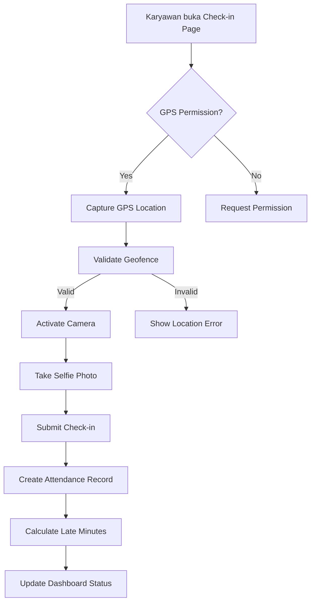

# Panduan Alur Kerja Sistem Absensi Coffee Shop

## 🔄 Alur Kerja Utama

### 1. Proses Login
```
User → Login Page → Input Credentials → API Authentication → Generate Token → Redirect to Dashboard
```

**Detail Proses:**
- User mengakses `/login`
- Sistem menyediakan quick demo login untuk berbagai role
- Authentication menggunakan email & password
- Laravel Sanctum menggenerate Bearer token
- Token disimpan di localStorage untuk API calls
- User diredirect ke dashboard sesuai role

### 2. Alur Check-in Karyawan



**Validasi Check-in:**
1. GPS location harus dalam radius geofence cabang
2. Foto selfie wajib diambil
3. Satu check-in per hari
4. Otomatis hitung keterlambatan

### 3. Alur Check-out

**Proses:**
1. Karyawan harus sudah check-in
2. Capture GPS location untuk check-out
3. Optional: Take selfie untuk verifikasi
4. Submit check-out
5. Hitung total jam kerja
6. Update status attendance

**Special Cases:**
- Overtime: Check-out bisa keesokan hari
- Missing checkout: Ada correction request system
- Early departure: Dicatat sebagai early minutes

### 4. Attendance Correction Flow

```
Missing Checkout → Request Correction → Manager Review → Approve/Reject → Update Record
```

**Jenis Correction:**
1. **Forgot Check-out** - Lupa check-out kemarin
2. **Wrong Time** - Salah input waktu
3. **Technical Issue** - Masalah teknis (GPS/Camera)
4. **Emergency Leave** - Pulang mendadak

### 5. Leave Request Workflow

```
Employee Request → Direct Manager → HR Approval → Balance Deduction → Calendar Update
```

**Tahapan:**
1. Employee submit leave request
2. Sistem cek leave balance
3. Manager pertama review
4. HR final approval
5. Otomatis potong balance
6. Update calendar & schedule

## 📊 Role-Specific Workflows

### A. Employee (Karyawan Biasa)
1. **Daily Tasks:**
   - Check-in pagi
   - Check-out sore
   - View attendance history
   - Submit leave requests
   - View schedule

2. **Monthly Tasks:**
   - Review attendance report
   - Check leave balance
   - Submit corrections if needed

### B. Branch Manager
1. **Daily Monitoring:**
   - Real-time attendance dashboard
   - Late arrivals notification
   - Missing checkouts alert
   - Approve urgent requests

2. **Weekly Tasks:**
   - Review attendance patterns
   - Adjust schedules
   - Handle correction requests
   - Generate branch reports

3. **Monthly Tasks:**
   - Performance review
   - Attendance analysis
   - Policy adjustments
   - Report to HR Central

### C. HR Central
1. **System Management:**
   - Policy configuration
   - Leave type management
   - Holiday calendar
   - System-wide reports

2. **Employee Management:**
   - Onboarding new employees
   - Role assignments
   - Cross-branch transfers
   - Termination process

3. **Compliance:**
   - Audit trail review
   - Policy enforcement
   - Legal compliance
   - Data privacy

### D. Pengelola (Multi-Branch Manager)
1. **Cross-Branch Tasks:**
   - Monitor up to 3 branches
   - Coordinate schedules
   - Handle emergencies
   - Backup management

## 🔧 Technical Workflows

### API Request Flow
```
Frontend → Ajax Call → API Endpoint → Middleware Auth → Controller → Service Layer → Model → Database
```

**Example: Check-in API**
```javascript
// Frontend
$.ajax({
    url: '/api/employee/attendance/checkin',
    method: 'POST',
    headers: {
        'Authorization': 'Bearer ' + token,
        'Accept': 'application/json'
    },
    data: {
        event_type: 'check_in',
        latitude: coords.latitude,
        longitude: coords.longitude,
        branch_id: selectedBranch,
        photo: base64Photo,
        notes: 'Via mobile app'
    }
});

// Backend Processing
1. Validate request data
2. Check employee status
3. Verify GPS location
4. Create attendance record
5. Calculate late minutes
6. Send notifications
7. Return response
```

### Database Transaction Flow
```php
DB::beginTransaction();
try {
    // Create attendance record
    $attendance = Attendance::create([...]);
    
    // Create event log
    AttendanceEvent::create([...]);
    
    // Update employee status
    $employee->update(['last_check_in' => now()]);
    
    // Send notifications
    $notificationService->notifyCheckIn($attendance);
    
    DB::commit();
} catch (Exception $e) {
    DB::rollBack();
    throw $e;
}
```

## 🚨 Error Handling Workflows

### 1. GPS Error
```
GPS Failed → Show Manual Location → Manager Override → Add Note → Process Attendance
```

### 2. Camera Error
```
Camera Failed → Try Alternative → Upload Photo → Manager Verification → Process
```

### 3. Network Error
```
Save Locally → Queue Request → Auto Retry → Sync When Online → Notify Success
```

## 📱 Mobile App Workflows (Future)

### Offline Mode
1. Cache employee data locally
2. Store attendance in queue
3. Sync when connection available
4. Handle conflicts intelligently

### Push Notifications
1. Check-in reminder (8:30 AM)
2. Check-out reminder (5:30 PM)
3. Leave approval updates
4. Schedule changes
5. Emergency announcements

## 🔐 Security Workflows

### Token Management
1. Token generated on login
2. Stored securely in localStorage
3. Sent with every API request
4. Refreshed periodically
5. Revoked on logout

### Permission Checking
```php
// Controller level
if (!$user->can('view-attendance', $branch)) {
    return $this->forbidden();
}

// Service level
$this->rbacService->checkPermission($user, 'manage-employees', [
    'branch_id' => $branchId,
    'scope' => 'branch'
]);
```

## 📈 Reporting Workflows

### Daily Reports
- Auto-generated at EOD
- Sent to managers
- Include: Attendance, Late, Absent

### Weekly Reports
- Trend analysis
- Overtime patterns
- Leave utilization

### Monthly Reports
- Full attendance matrix
- Performance metrics
- Payroll data export

## 🔄 Integration Workflows

### Payroll Integration (Planned)
```
Attendance Data → Validation → Transform → Export → Payroll System → Confirmation
```

### HRIS Integration (Planned)
```
Employee Master → Sync → Local Database → Bi-directional Updates → Audit Log
```

## 🛠️ Maintenance Workflows

### Daily
- Backup database
- Check system health
- Monitor API performance
- Review error logs

### Weekly
- Archive old photos
- Cleanup expired tokens
- Update statistics cache
- Security patches

### Monthly
- Full system backup
- Performance optimization
- Security audit
- Update documentation

## 📝 Best Practices

### For Developers
1. Always use transactions for data integrity
2. Implement proper error handling
3. Log all critical actions
4. Follow Laravel conventions
5. Write tests for new features

### For Administrators
1. Regular backup schedules
2. Monitor system resources
3. Keep documentation updated
4. Train users properly
5. Review audit logs

### For End Users
1. Always check-in/out on time
2. Keep app permissions enabled
3. Report issues immediately
4. Update profile information
5. Follow company policies
